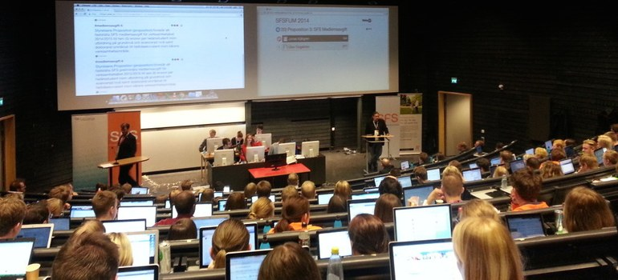

# About VoteIT

**VoteIT is the web tool to help you host your democratic and participatory meetings online. VoteIT keeps agenda, discussion, proposals and polls gathered in a sleek and simple interface. The participants choose their own facilitator or moderator for the meeting who keeps everything in order and sets up new agenda items or polls when the meeting needs them.**

VoteIT is a free and open source project and is free to [download from GitHub](https://github.com/VoteIT) to run on your own server. (Note! Version 4 isn't published yet but will be during spring 2023!) The project began in 2009 when [the Swedish gaming federation (Sverok)](https://www.sverok.se/) was granted the first of two €100 000 grants from the [Swedish Inheritance Fund](https://arvsfonden.se/). This first part of the project was completed in the fall of 2011 with the mote.voteit.se website going live.

## Who is behind VoteIT
There are several different organisations who have participated in creating and are involved in further developing VoteIT. Sverok and [Betahaus](http://www.betahaus.net/) began the work in 2009 and in the last months of 2011 a new not-for profit organisation was formed – VoteIT.

There are around 80 Swedish member organisations today.

These organisations, and many more, are committed to spread, develop and use VoteIT as a tool for improved democracy and easier participation.

## Try VoteIT
At the moment we do not have a server running with the English version of VoteIT. If you're interested in testing the new version of VoteIT, contact us.

## Contact and support
Please send questions about VoteIT [over e-mail](mailto:info@voteit.se) and we will reply shortly.
Our twitter account is of course [@voteit](http://www.twitter.com/voteit)
