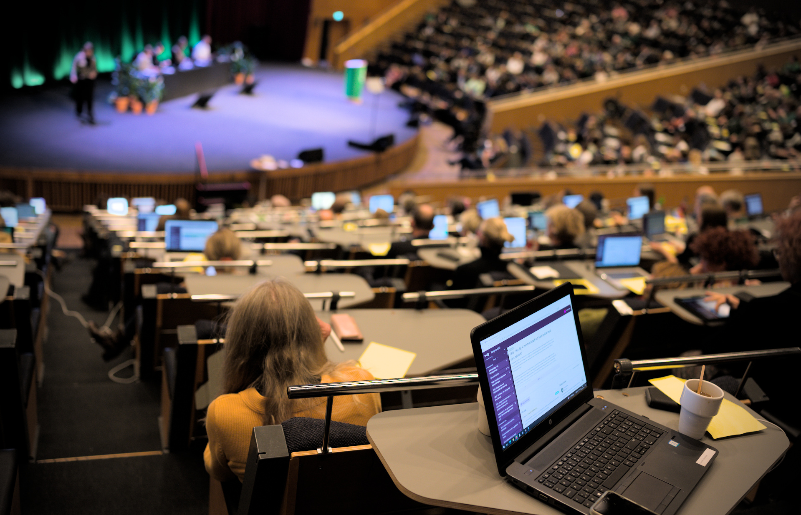

# VoteIT - bättre beslutsmöten

**I VoteIT kan mötesdeltagare lägga förslag, diskutera, fatta beslut. Mötet kan ske helt online eller i kombination med fysiskt möte där deltagarna träffas och använder VoteIT för att fatta beslut. VoteIT är i alla delar fri och öppen programvara och omhändertas av den ideella föreningen VoteIT.**

## Ett helt nytt VoteIT

Den 4e generationen VoteIT är nu i drift! Det har utvecklats under 3 år och kört skarpa möten sen 2021. De stora nyheterna är:

- Allting är i realtid. Alla förändringar syns direkt utan fördröjning.
- Inga begränsningar i deltagare för möten. Vi har kört möten med 1 000 deltagare redan, utan serveranpassningar fungerar ca 3000 för realtidsmöten.
- Policys och mötesdialekter automatiserar fler funktioner i mötet - om ni vill.
- Integration och inloggning via medlemsregister, epost, BankID, eller kanske ett intranät?
- Fungerar för onlinemöten, fysiska möten, hybridmöten, videomöten, styrelsemöten.
- Viktade röster eller röster från grupper för den som behöver.
- Extremt låga bandbreddskrav - bara förändringar skickas till deltagare. Fungerar att köra utan bredbandsanslutning.
- Automatiserade eller automatiska röstlängder utifrån vilket sorts möte ni vill ha.
- Nyfiken? Prova demomötet: [demo.voteit.se](https://demo.voteit.se)

## Utvecklingsprojekt

VoteIT är ett levande projekt som utvecklas för att möta medlemmarnas demokratiska behov.

- [Utvecklingsprojekt](./utvecklingsprojekt/)

## I VoteIT finns

- Digitalt stöd för att hålla årsmöten i enlighet med svensk lag
- Hantering av dagordning, förslag, diskussioner och omröstningar
- Röstlängder och närvarokontroll
- Avancerade omröstningsmetoder (Schulze, majoritetsbeslut, kontrapropositionsvoteringar, flervalsvoteringar)
- Textändringsförslag för tydlig behandling av förslagstexter (ex verksamhetsplan)
- Talarlistor och talarstatistik
- Arbetsflöden för yrkanden, dagordningspunkter och hela möten – du ser hela tiden vad som är obehandlat, under behandling och färdigt.
- Automatiskt genererade protokoll

## Föreningen VoteIT

VoteIT har vuxit fram genom ett unikt samarbete mellan en rad olika organisationer runt om i Sverige. Systemet används idag av många små och stora organisationer för att hålla årsmöten, styrelsemöten, beredningsprocesser och mycket annat. De organisationer som är extra engagerade i utvecklingen av VoteIT är medlemmar i Föreningen VoteIT som arbetar för att mötesprogramvaran VoteIT vårdas och utvecklas, samt sprider kunskap om nätbaserade beslutsmöten.

## Prova på VoteIT

Om din organisation vill prova på VoteIT bokar vi gärna en genomgång, eller skapar ett demomöte där ni får prova själva. [Kontakta oss](/kontakt/) och berätta kort om er organisation, så bokar vi gärna en demonstration.

## Engagera dig

VoteIT är ett open-source-projekt och vi letar hela tiden efter utvecklare och andra personer som vill bidra på olika vis till utvecklingen - och efter organisationer som kan tänka sig att vara med som samverkanspartners. Vi söker särskilt engagerade som kan skriva manualer, koda Python, CSS, JavaScript, eller som kan jobba med vår hemsida eller sociala medier. Hör av dig!

## Att genomföra ett möte

Oavsett om din organisation vill genomföra ett möte online eller live möter VoteIT era behov, men tänk på att olika mötesformer kräver olika metodik. Vi har erfarenheter från mer än tio år av demokratiska möten och processer, och vet vad som fungerar och inte fungerar. Att flytta en beslutsprocess från ett livemöte till ett onlinemöte kräver att ni tänker lite annorlunda, och planerar om vissa delar.

### Läs mer

- [Att tänka på för bra onlinemöten](/skapa-mote/att-tanka-pa.html)
- [Hur är onlinemöten annorlunda?](/skapa-mote/onlinemoten-annorlunda.html)
