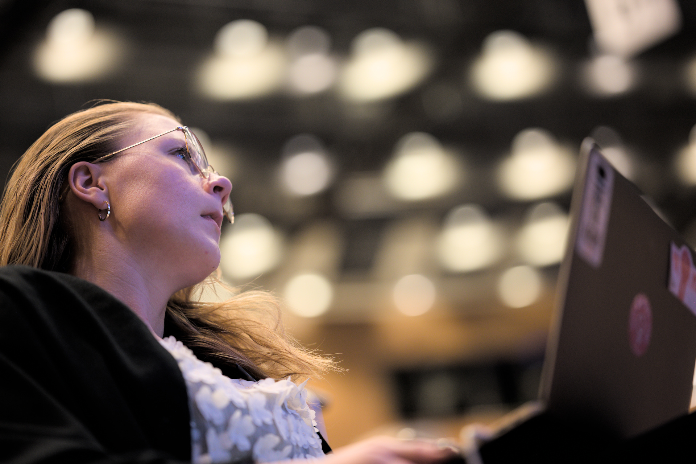

# Lär dig mer

Vill du lära dig mer om omröstningsmetoder i VoteIT, eller om de olika metoderna för att ta en röstlängd? Då har du hittat rätt.

## Omröstningsmetoder och kriterier

Att välja rätt omröstningsmetod är viktigt för att få ett demokratiskt och rättvisande resultat.

- [Omröstningsmetoder](omrostningsmetoder.md)
- [Kriterier](kriterier.md)
- [Om Schulze-metoden](schulze.md)

## Röstlängder

För att genomföra omröstningar i ert VoteIT-möte behöver ni kunna fastställa röstlängd. För det krävs att ni ställer in en metod för röstlängder.

- [Metoder för röstlängd](rostlangdsystem.md) - Hur användare får rösträtt
- [Närvaro och rösträtt](narvaro-rostratt.md)

## Skräddarsydda möten

- [Mötesdialekt](motesdialekt.md) - Hanterar anpassningar av möten till föreningars specifika behov