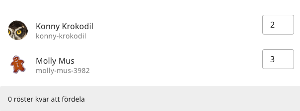

# Mötesdialekt

Föreningar är olika - VoteIT är från gunden byggt för att kunna hantera det. För att den processen ska bli enklare så
finns mötesdialekter. De kan innehålla speciella regler eller inställningar för mötet. 
Dels för att hantera speciella regler i föreningen eller för att underlätta för deltagarna.

Även funktioner som inbjudningar påverkas av mötesdialekten, där det t.ex. går att göra inbjudningar som redan från början lägger till
deltagare i en speciell grupp och kanske ger dem en roll i den gruppen.

Medlemmarna i VoteIT kan bygga sina egna dialekter, eller få hjälp att göra det.

Exempel på mötesdialekter

## Ordinarie och ersättare

Grupperna får inställningen antal röster, och två roller som heter *Ordinarie* och *Ersättare*.
Rollerna går att tilldela personer som är medlemmar i gruppen. Alla som får någon av gruppens roller får dessutom
förslagsrätt och diskussionsrätt i mötet.

Baserat på hur många röster gruppen har fördelas sen rösterna till gruppens medlemmar. Först till ordinarie, sen till ersättare.

## Studentkårernas delegationer

Grupperna i möten är istället delegationer, som kan ha en eller flera delegationsledare.
Delegationsledarna ansvarar för att fördela rösterna mellan medlemmarna i grupperna.

Om någon av delegationerna inte kan vara med, så kan de utse ombud som röstar i deras ställe. Då förs röstvikterna över till den delegationen istället.

## Bolagsstämma

De olika grupperna av ägare blir grupper i mötet. Rösterna fördelas mellan närvarande deltagare som sen röstar med viktade röster.
