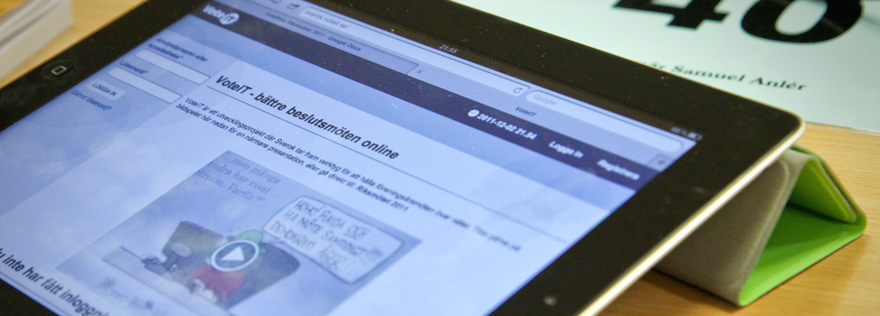

# Skapa möte

**Föreningen VoteIT har som målsättning att alla som vill ska kunna hålla sina möten i VoteIT. Detta kan ske på något av sätten nedan.**

## 1. Prova på
Gå till vår testsida där du kan registrera dig och prova på i demomötet som finns där. Prova att navigera i dagordningen, skriv förslag, diskutera och rösta. Om du vill ha en genomgång, eller ett eget möte för att prova på, kan du [kontakta oss](/kontakt/).

[...till demomötet](https://demo.voteit.se/)

## 2. Bli medlem i VoteIT
Ansök om medlemskap i föreningen VoteIT och skapa hur många möten ni vill. Medlemskapet kostar i dagsläget 10 000 kr per år och för det får man en egen designanpassad VoteIT-instans med möjlighet att hålla obegränsat antal möten. Medlemmar får också möjlighet att vara med och påverka föreningen och VoteIT utveckling framåt.

[...om medlemskap och föreningen](/om-voteit/)
