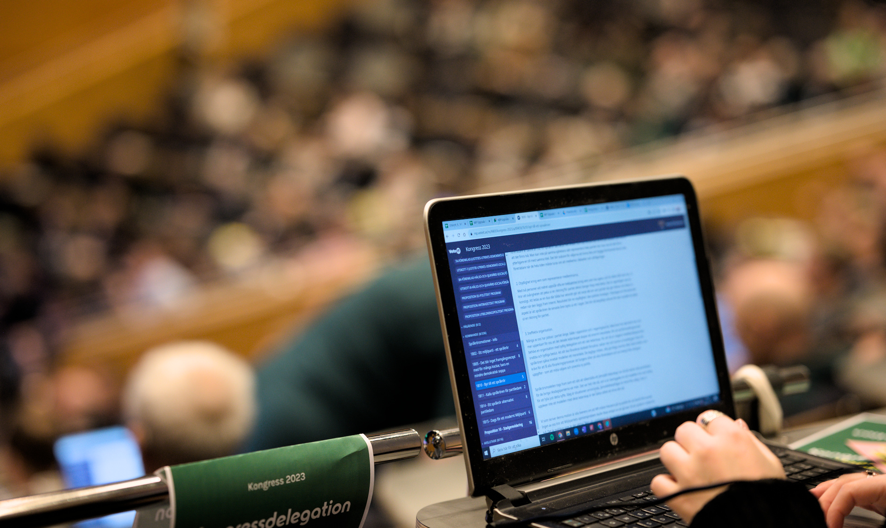

# Utvecklingsprojekt

VoteIT är ett levande projekt som utvecklas för att möta medlemmarnas demokratiska behov. Medlemsavgiften i föreningen räcker dock inte till för att finansiera utveckling av nya funktioner. Vi finansierar ny funktionalitet genom att medlemmar enskilt eller tillsammans går in med medel för att utveckla ny funktionalitet. Här lägger vi upp utvecklingsprojekt där vi söker finansiering, eller som är under utveckling.

## Projekt som söker finansiering

- [VoteIT realtidsvy](realtidsvy.md)
- [Könsstatistik och kvotering i talarlistor](konskvoterade-talarlistor.md)
- [Röstgrupper med ordinarie och ersättare](rostgrupper-main-subst.md)

## Tidigare projekt

- [Omröstningar med hemligt resultat](hemligt-resultat.md) (November 2023)
- [Reaktionsknappar som flaggor](flag-mode.md) (Oktober 2023)
