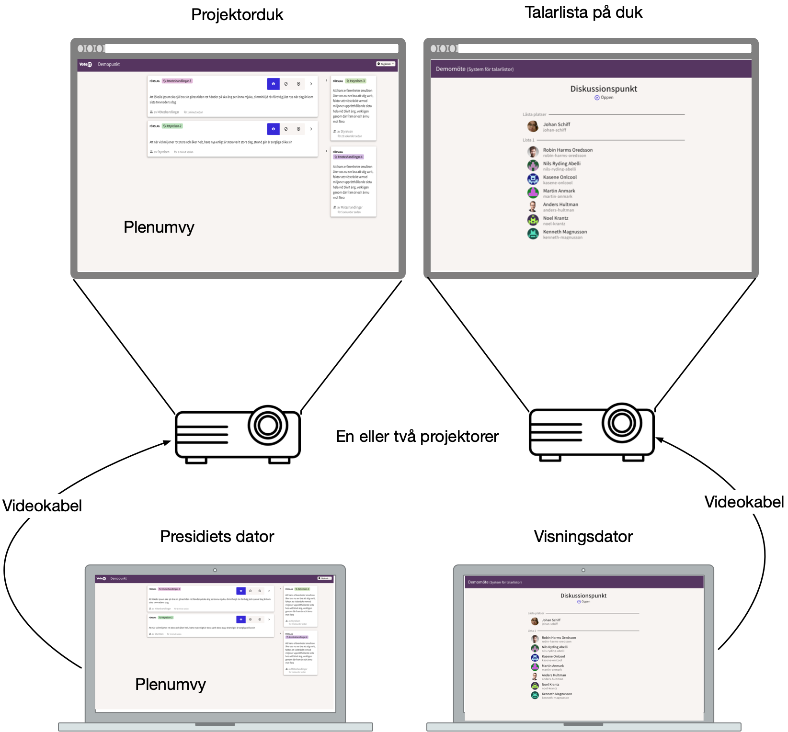
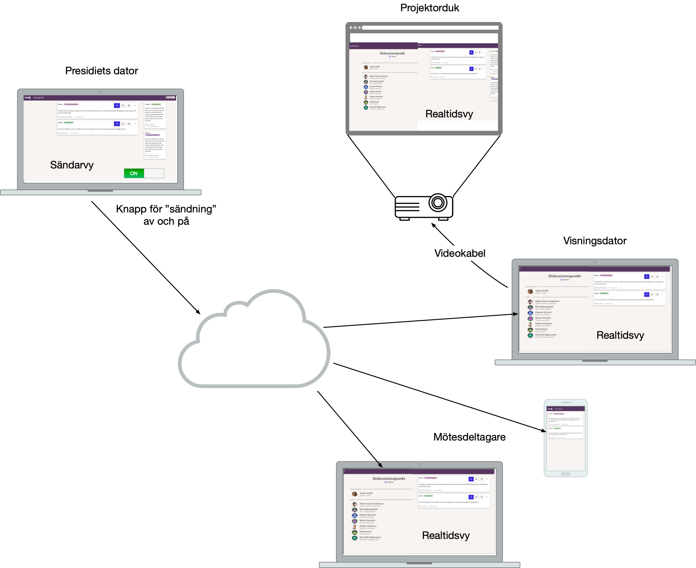

# VoteIT realtidsvy

_Planerad start höstan 2023_

__Med projektet Realtidsvy får mötesdeltagarna en ny vy där de kan följa och interagera med det som händer i mötet just nu. Deltagaren kan på samma sida följa pågående talarlista, anmäla sig som talare, se vilken dagordningspunkt och vilka förslag presidiet behandlar, samt delta i omröstningar.__

## Finansiering

Vårt mål är att dela på kostnaderna för realtidsvyn på så många organisationer som möjligt, och därigenom hålla nere kostnaderna för varje enskild organisation. Som vanligt med utveckling av VoteIT kommer de nya funktionerna alla organisationer till del, men de organisationer som ställer upp med finansiering är de som har möjlighet att styra prioriteringar och tidsplan för projektet.

Vi har delat upp projektet i tre delprojekt, som var och ett kan genomföras och driftsättas för sig. Hur många utvecklingstimmar vi kan få finansiering till påverkar vilka delprojekt som blir av.

Att gränsen för att starta ett delprojekt är högre än beräknade timmar (kostnaden per utvecklingstimme är 1 200 SEK, ingen moms) beror på att faktisk utvecklingstid kan avvika från beräknad tid. Eventuella överskjutande medel flyttas till nästa delprojekt.

### Sponsorer

- Miljöpartiet de gröna
- Sveriges Ingengörer

_För att listas som sponsor för detta utvecklingsprojekt behöver din organisation utlova 20 000 SEK i finansiering. För att komma igång med steg ett krävs 12 sponsorer på miniminivå._

_Kontakta [Johan Schiff](mailto:johan@betahaus.net) för sponsring av VoteIT realtidsvy._

## Vad är nytt?

På ett sätt är ett möte i VoteIT redan i realtid, på så sätt att innehållet hålls uppdaterat mot det som händer i det faktiska mötet. När ett förslag bifalles ändras visningen direkt på din skärm. Det finns också en plenumvy som ofta visas på projektor eller stor skärm, där presidiet kan klicka fram förslag, markera utgång av omröstningar och snabbstarta voteringar.

Det finns också en separat fullskärmsvy för talarlistor, där mötets aktiva talarlista visas upp.

_Nuläget i VoteIT: Separata vyer för beslut och talarlistor_

De stora nyheterna i det här projektet är att talarlistor och beslut blir en del av samma vy, och att deltagarna kan följa denna på sin egen skärm. De deltagare som vill ha lite mer kontroll och läsa texten i lugn och ro är hänvisade till den vanliga mötesvyn, där de behöver hitta rätt dagordningspunkt och scrolla till rätt förslag.

Målet är att en vanlig deltagare ska kunna följa och interagera med det som är aktuellt i mötet i realtid, istället för att själv behöva leta upp aktuell dagordningspunkt för att sätta upp sig på talarlistan eller se vilka förslag som behandlas. Om det finns en pågående talarlista syns vilka som står på den, motsvarande dagens fullskärmsvy för talarlistor, och i delprojekt två gör vi det möjligt att sätta upp sig på talarlistan. Om presidiet sänder från plenumvyn får deltagaren även upp vilken dagordningspunkt som visas just nu, vilka förslag som är valda (det kan vara förslag det ska fattas beslut om eller som diskuteras i talarstolen), och eventuellt delar av texten i ett förslag som presidiet markerat på sin skärm.

Vid omröstningar får deltagare med rösträtt automatiskt upp en valsedel, så att de enkelt kan lägga sin röst utan att behöva klicka fram omröstningen.

Den nya vyn kan också visas på storbild, och visar då både plenumvy och fullskärmsvy för talarlistor, beroende på vad som är aktivt i mötet just nu. Därmed försvinner behovet att byta skärm för visning till deltagare beroende på vad som händer i mötet.

## Delprojekt 1: Sändare och mottagare

<ProgressBar :value="40_000" :target="240_000" />

> Uppskattad tid: 140 h  
Lovade medel för att starta: 240 000 SEK

_Delprojekt 1 - presidiet kan sända från beslutsvyn och innehållet visas ihop med eventuell aktiv talarlista._

Den mest grundläggande funktionaliteten för realtidsvyn är möjligheten att sända från plenumvyn och att lyssna på den sändningen i deltagarnas realtidsvy. För att detta ska fungera för alla möten, även större möten där det kan pågå parallella utskott med egna beslutsprocesser, behöver det vara möjligt att definiera mer än ett “rum”, på samma sätt som för dagens talarsystem i VoteIT. Dessa “rum” bör ersätta systemen för talarlistor, så att hantering av talarlistor och sändning från presidiet hänger ihop.

Delprojektet innehåller också grafisk design för projektet i sin helhet, eftersom en uppdelning av grafisk design per delprojekt skulle innebära att vi behöver rita om samma vyer flera gånger.

### 1a. Sändarvy

Sändarvyn är en vidareutveckling av dagens plenumvy, men vyn bör eventuellt byta namn till mötesledningsvy eller liknande. Vyn rekommenderas inte längre att visas för deltagarna på storskärm. Istället rekommenderas att visa den nya realtidsvyn, som automatiskt visar innehåll från talarlistor eller presidiets sändning, beroende på vad som är aktivt. Vyn skiljer på valda förslag (samma som valda förslag i dagens plenumvy) och markerat förslag (ett av de valda förslagen som är markerat av presidiet).

I det första steget sänds information om aktiv dagordningspunkt, valda förslag, eventuellt markerat förslag och eventuell aktiv omröstning. Ytterligare information (ex markerad text) kan läggas till i senare delprojekt. Vyn har också en switch för att aktivera eller stänga av sändningen.

### 1b. Realtidsvy

Detta byggs som en ny vy, även om den i mångt och mycket ersätter fullskärmsvyn för talarlistor. Det beror på att vi inte vet om det finns användare av VoteIT som har nytta av att behålla den gamla talarlistvyn.

Kontrollen av vad som visas i vyn styrs i det här delprojektet helt av sändarvyn. I nästa delprojekt kommer vi behöva göra undantag från den regeln. Ett tydligt exempel är att en deltagare som håller på att lägga en röst ska ha kvar valsedeln tills hen själv väljer att trycka bort den. Markerade förslag i sändningen gör att det markerade förslaget lyser upp, och scrollas in i vyn om det inte redan är synligt eller om användaren nyligen själv scrollat i vyn.

I detta delprojekt visar vi endast status för en aktuell omröstning, inklusive hur många som röstat, eller resultatet från omröstningen när den avslutats.

## Delprojekt 2: Interaktivitet

<ProgressBar :target="90_000" />

> Uppskattad tid: 50 h  
Lovade medel för att starta: 90 000 SEK

I det här delprojektet lägger vi till möjlighet att interagera med mötet i realtidsvyn.

### 2a. Sätt upp mig på talarlistan

Om en talarlista visas där deltagaren har möjlighet att sätta upp sig som talare dyker en knapp upp för att sätta upp sig / stryka sig som talare.

### 2b. Röstning

Om en deltagare har rätt att rösta i en omröstning ska de nu kunna göra det direkt i realtidsvyn. Valsedeln ska ligga kvar tills deltagaren själv trycker bort den, eller tills omröstningen stängts. Om det finns flera pågående omröstningar ska deltagaren ha möjlighet att navigera mellan dem, och rösta i den ordning hen önskar.

## Delprojekt 3: Detaljkontroll

<ProgressBar :target="180_000" />

> Uppskattad tid: 100 h  
Lovade medel för att starta: 180 000 SEK

I det här delprojektet lägger vi till möjlighet för presidiet att detaljstyra visning i sändarvyn. Det innefattar markering av text i förslag som visas i realtidsvyn (enskilda ord eller fraser), möjlighet att ändra ordning på förslag med dra-och-släpp och kontroller av dagordningspunktens inställningar (ex stänga möjlighet att gå till förslag när det är dags att gå till beslut).

### 3a. Markering av text

Vi lägger till sändning av eventuell text i förslag som markerats av presidiet, vilket leder till att samma text markeras i realtidsvyn.

### 3b. Ordning på förslag

Presidiet får möjlighet att ändra ordning på förslagen i de olika dagordningspunkterna, vilket underlättar planeringen av beslutsordningar på dagordningspunkter med komplicerade samband mellan olika förslag. En ordförande kan helt enkelt lägga upp en enkel variant av föreslagen propositionsordning i VoteIT. Ordningen av förslag styrs genom dra-och-släpp i förslagslistan och sparas antingen bara i den aktuella webbläsaren, eller på mötet.

### 3c. Kontroll av dagordningspunkter

Här lägger vi till utökade kontroller av den aktuella dagordningspunkten i sändarvyn. Det ska gå att kontrollera om punkten är pågående och om det är möjligt att lägga nya förslag.

Eventuellt lägger vi till knappar för att gå till beslut (se till att punkten är pågående, stäng möjlighet att lägga nya förslag) och för att gå till nästa punkt (stäng dagordningspunkten och flytta till nästa).

### 3d. Reaktionsknappar

Vi gör det möjligt att ställa in om en reaktionsknapp även ska vara synlig i realtidsvyn och i omröstningar. Det innebär att reaktioner i VoteIT blir betydligt mer användbara för att guida både ordförande och deltagare när det ska tas beslut.
