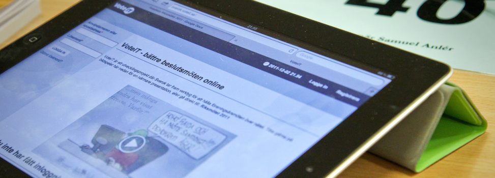

# Skapa möte

**Föreningen VoteIT har som målsättning att alla som vill ska kunna hålla sina möten i VoteIT. Detta kan ske på något av sätten nedan.**

## 1. Prova på
Gå till vår testsida där du kan registrera dig och prova på i demomötet som finns där. Prova att navigera i dagordningen, skriv förslag, diskutera och rösta.

[...till demomötet](https://mote.voteit.se/)

## 2. Bli medlem i VoteIT
Ansök om medlemskap i föreningen VoteIT och skapa hur många möten ni vill. Medlemskapet kostar i dagsläget 10 000 kr per år och för det får man en egen designanpassad VoteIT-instans med möjlighet att hålla obegränsat antal möten. Medlemmar får också möjlighet att vara med och påverka föreningen och VoteIT utveckling framåt.

[...om medlemskap och föreningen](/om-voteit/)

## 3. Installera och köra själv
VoteIT är fri och öppen programvara och kan därför laddas ner av vem som helst. Det går bra att ladda ner progammet direkt från github och installera det på egen server.

[...till programkoden på GitHub](https://github.com/VoteIT)